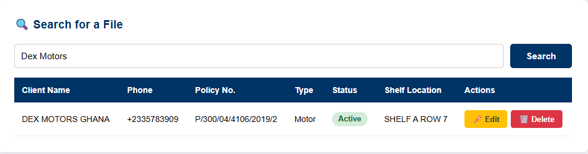

# 🗂️ Insurance Policy Tracker

A full-stack web application built with Python (Flask) and SQL to manage 
insurance policy files digitally — replacing manual, paper-based systems.

## 🖥️ Live Preview

### Dashboard & Document Intelligence

### All Policies View

### Edit Client & Policy

### Search Functionality

## 💡 Problem It Solves
Managing insurance policy files manually is slow and error-prone. 
This app gives teams a clean digital system to manage all client 
policies in one place — reducing file search time from minutes to seconds.

## ⚙️ Features
- ➕ Add new clients and policy records
- 🔍 Search any client by name instantly
- ✏️ Edit existing records
- 🗑️ Delete outdated entries
- 🚨 Risk Dashboard — flags expiring policies, duplicates, and missing data
- 🤖 Document Intelligence — upload a PDF and AI extracts policy details automatically

## 🛠️ Tech Stack
- **Python** & **Flask** — backend web framework
- **SQL** & **SQLite** — relational database with 3 linked tables
- **HTML & CSS** — frontend interface
- **Jinja2** — templating engine
- **Google Gemini API** — AI-powered PDF data extraction

## 📐 Database Design
Three linked tables:
- `clients` — stores client personal details
- `policies` — stores policy information linked to clients
- `file_log` — stores physical shelf location of each file

## 🚀 Scalability
This project can be scaled for large insurance firms, law offices, 
hospitals, or any organisation that relies heavily on physical files by:
- Swapping SQLite for PostgreSQL
- Deploying to cloud platforms (Railway, Render, AWS)
- Adding analytics dashboards and automated renewal alerts

## 👤 Author
**Evans Boateng** | Data Science Student  
Georg-August-Universität Göttingen
